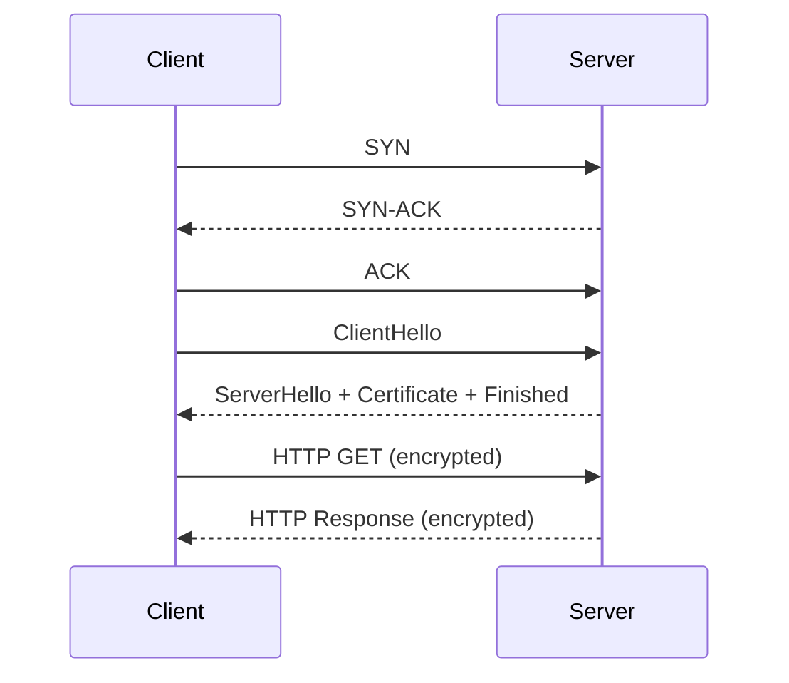

# TLS Python Playground

A hands-on repo for dissecting TLS end-to-end using Python.  
Explore raw TCP handshakes, TLS record layers and certificate chains.

## Repo Structure

```text
tls-python-playground/
├── module1_plain_http.py      # TCP handshake sniffer + plain HTTP GET
├── module2_wrap_socket.py     # TLS handshake sniffer + SSLContext request + cert inspection
├── module3_full_parser.py     # Full TLS record parser for multiple records per packet
├── module4_cert_chain.py      # Certificate chain explorer with SAN, KeyUsage, AIA
└── README.py                  # Course overview in Python docstring
```

## Module Overviews

### Module 1: TCP Handshake Sniffer
- Captures SYN, SYN-ACK, ACK, PSH, and FIN flags.  
- Prints human-friendly annotations for each step of the TCP three-way handshake and teardown.

### Module 2: TLS Handshake & Leaf Certificate Inspection
- Sniffs TLS records (Handshake, ChangeCipherSpec, ApplicationData).  
- Performs a real TLS 1.3 handshake with `ssl.SSLContext`.  
- Prints the negotiated cipher suite and inspects the server’s leaf certificate.

### Module 3: Full TLS Record Parser
- Splits every TCP packet into all contained TLS records.  
- Labels each record by content type and, for handshake records, by sub-message (ClientHello, Certificate, Finished, etc.).

### Module 4: Certificate Chain Explorer
- Uses PyOpenSSL (via `get_peer_cert_chain`) or `ssl.getpeercert` fallback.  
- Prints the full server certificate chain with:  
  - Subject & Issuer  
  - Validity period  
  - Subject Alternative Names (SAN)  
  - Key Usage  
  - Authority Information Access (OCSP, CA Issuers)

## TLDR

Think of TLS like sending a secret letter through the postal system:



1. **TCP Handshake (Address Card Exchange)**  
   - **SYN**: "Hey, I’m here—can we talk?"  
   - **SYN-ACK**: "I hear you—ready when you are."  
   - **ACK**: "Connection established!"

2. **TLS Handshake (Sealed Envelope & ID Check)**  
   - **ClientHello**: "Here’s what envelopes and seals I support."  
   - **ServerHello**: "I choose this seal and here’s my notary’s stamp."  
   - **Certificate Validation**: Client verifies the notary’s stamp against trusted CAs.  
   - **Finished**: Both confirm the envelope is sealed correctly.

3. **TLS Records (Mailbag Inspection)**  
   - Each TLS record is like an individual sealed envelope:  
     - **Handshake**: exchanging setup messages.  
     - **ApplicationData**: carrying your HTTP inside the sealed envelope.

4. **Certificate Chain (Stamp Trail)**  
   - The notary’s stamp (leaf cert) links back through intermediates to a root.  
   - Inspect each stamp’s subject, issuer, validity, and extensions.